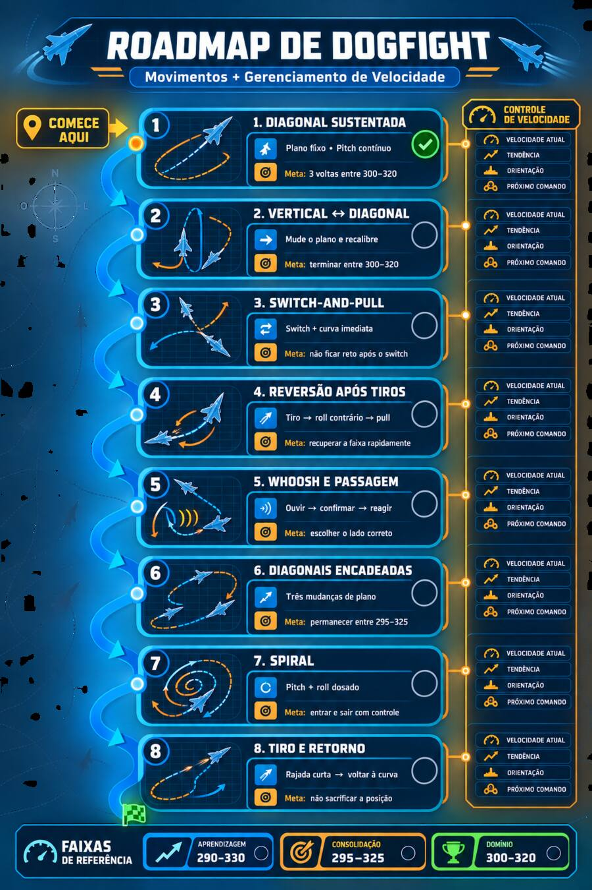

# BF3 Dogfight Roadmap

Curso prático para desenvolver movimentos de dogfight em jatos do **Battlefield 3** sem separar técnica de manobra e gerenciamento de velocidade.

O objetivo não é decorar truques isolados nem manter `313` em círculos perfeitos. É aprender a **preservar ou recuperar a faixa de velocidade enquanto o plano da luta muda**.

## Como usar

1. Leia o [método de treinamento](docs/00-metodo-de-treinamento.md).
2. Comece no módulo 1, mesmo que já consiga fazer loops horizontais e verticais.
3. Treine o movimento sozinho, depois com parceiro cooperativo e finalmente em dogfight livre.
4. Avance pelo critério do módulo, não por vitórias.
5. Registre cada sessão no [diário de treino](docs/diario-de-treino.md).

## Roadmap

| Etapa | Movimento | Competência central | Faixa para concluir |
|---:|---|---|---:|
| 1 | [Diagonal sustentada](docs/modules/01-diagonal-sustentada.md) | Estabilizar um plano diagonal | 300–320 |
| 2 | [Vertical ↔ diagonal](docs/modules/02-vertical-diagonal.md) | Recalibrar após mudar o plano | 300–320 |
| 3 | [Switch-and-pull](docs/modules/03-switch-and-pull.md) | Curvar imediatamente após o switch | 295–325 |
| 4 | [Reversão após tiros](docs/modules/04-reversao-apos-tiros.md) | Responder sem congelar | 295–325 |
| 5 | [Whoosh e passagem](docs/modules/05-whoosh-e-passagem.md) | Ouvir, confirmar e reagir | 295–325 |
| 6 | [Diagonais encadeadas](docs/modules/06-diagonais-encadeadas.md) | Sustentar três mudanças de plano | 295–325 |
| 7 | [Spiral](docs/modules/07-spiral.md) | Coordenar pitch, roll e altitude | 295–325 |
| 8 | [Tiro e retorno](docs/modules/08-tiro-e-retorno.md) | Atirar sem abandonar a curva | 300–320 |

## Modelo mental permanente

Em qualquer etapa, processe sempre na mesma ordem:

> **Velocidade atual → tendência → orientação → próximo comando**

- **Velocidade atual:** em que número estou?
- **Tendência:** está aumentando, diminuindo ou estável?
- **Orientação:** estou subindo, descendo ou quase horizontal?
- **Próximo comando:** acelerar, dar um pulso de afterburner, aguardar ou conter?

## Faixas de referência

- **Aprendizagem — 290–330:** entender a geometria do movimento.
- **Consolidação — 295–325:** reduzir correções grandes.
- **Domínio — 300–320:** levar a técnica para dogfight livre.

Consulte também o [glossário](docs/glossario.md).

> Este é um material comunitário de treinamento, não oficial e sem vínculo com EA ou DICE.
