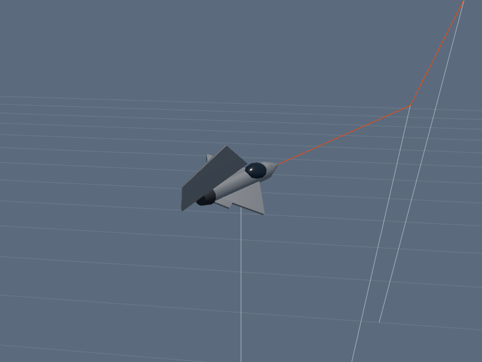
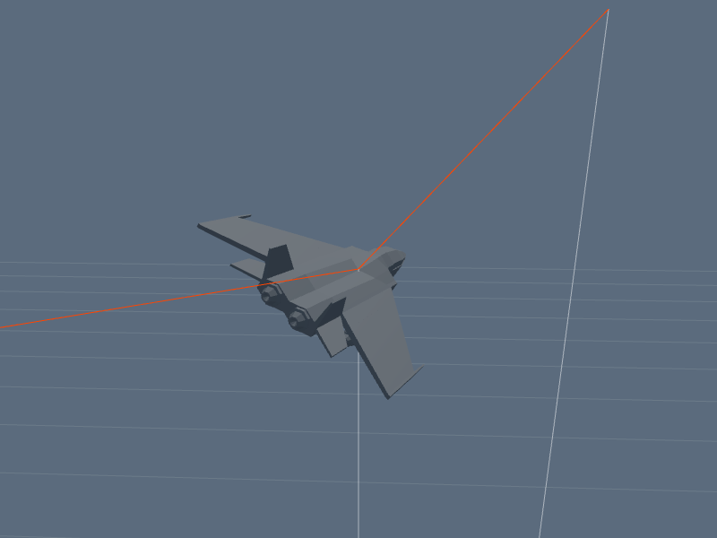
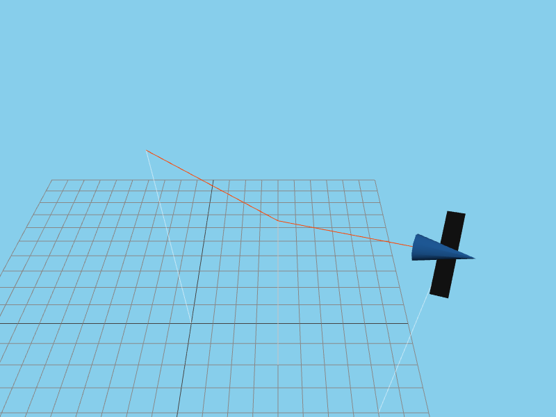
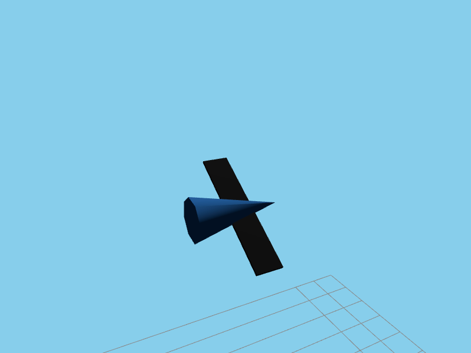

# Módulo 1 — Diagonal sustentada

## Visualização

| Início | Meio | Saída |
|---|---|---|
|  310, estável, —, manter |  300, caindo, —, AB curto |  312, subindo, —, conter |

## Objetivo

Transformar a diagonal em uma curva básica previsível. A meta não é mudar o plano; é escolher uma inclinação, parar o roll e descobrir o ritmo de velocidade desse plano.

## Por que é diferente

Na horizontal, a gravidade interfere pouco na velocidade. Na vertical, interfere muito, porém com subida e descida claramente definidas. A diagonal mistura os dois comportamentos. Quanto mais vertical o plano, maior a perda na metade ascendente e o ganho na descendente.

## Sequência técnica

1. Entre entre 300 e 320.
2. Faça roll até uma diagonal suave.
3. Pare o roll completamente.
4. Mantenha pitch contínuo.
5. Identifique metade ascendente e descendente.
6. Use pequenos pulsos; não copie mecanicamente o ritmo do loop vertical.

## Exercício solo

Faça três voltas para a esquerda e três para a direita em três inclinações:

- Suave: pouca influência vertical.
- Média: influência claramente perceptível.
- Acentuada: próxima do loop vertical.

Não altere a inclinação no meio da repetição. Se corrigir o roll continuamente, você deixa de produzir uma curva repetível.

## Com parceiro

O parceiro acompanha por fora sem atirar. Sua única tarefa é manter o plano e a velocidade. Diga `subindo` e `descendo` a cada metade.

## Erros comuns

- Aplicar potência de loop vertical numa diagonal suave e ultrapassar 320.
- Manter `S` por hábito durante a subida.
- Continuar rolando lentamente sem perceber.
- Olhar o HUD durante tempo demais.

## Critério para avançar

- Três voltas por lado entre 300–320.
- No máximo duas saídas da faixa.
- Plano visualmente estável.
- Capacidade de dizer se a velocidade está subindo ou caindo.

[← Método](../00-metodo-de-treinamento.md) · [Próximo: Vertical ↔ diagonal →](02-vertical-diagonal.md)
